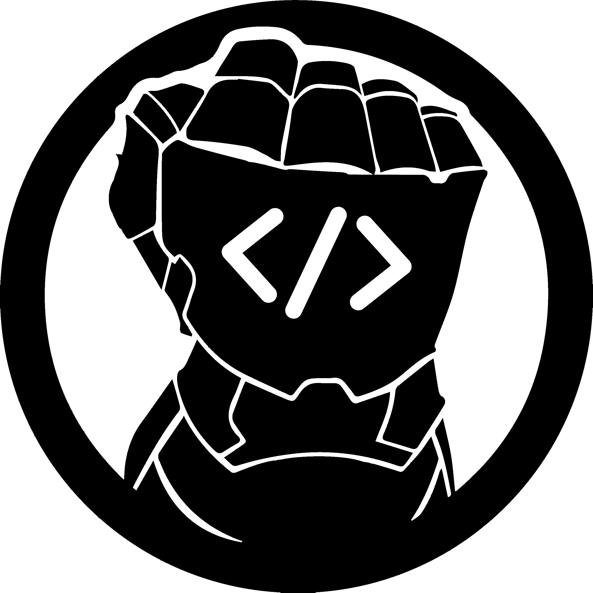

# Docunator JS (Work in progress)



A simplistic JavaScript library for generating documentation from code comments. Docunator JS helps developers create well-structured and easy-to-read documentation for their projects.
The resulting file is a JSON object that can be further processed or converted into various formats like HTML, Markdown, etc.

## Usage

Add the @docunator tag to your code comments to indicate that they should be included in the documentation.
Additionally, you can use different tags besides @docunator to provide more information about the documented item.
That way, you can generate several different documentations from within the same codebase.

```javascript
/**
 * @docunator
 * @title ZenButton
 * @author Danilo Ramírez Mattey
 * @version 1.0.0
 * @description A simple button component that can be used throughout the app. It supports different types (primary, secondary, success, info, warning, danger) and all of them are styled according to the current theme. The text color will be automatically selected based on the brightness of the button color, but it can be overwritten by passing a textColor prop.
 * @category Themed Components
 * @param {string} title The title of the button
 * @param {string} type - The type of the button. Can be 'primary', 'secondary', 'success', 'info', 'warning', or 'danger'. Default is 'primary'.
 * @param {string} textColor - The color of the button text. If not provided, it will be automatically selected based on the button color.
 * @param {boolean} fill - Whether the button should fill the width of its container. Default is true.
 * @param {number} touchableOpacity - The opacity of the button when pressed. Default is 0.7.
 * @param {function} pressAction - Alias for pressAction
 * @param {function} onPress - onPress action
 * @param {function} longPressAction - Alias for longPressAction
 * @param {function} onLongPress - onLongPress action
 * @param {string} leftIcon - The left icon of the button. Should be a valid icon name from the ZenIcon component.
 * @param {string} rightIcon - The right icon of the button. Should be a valid icon name from the ZenIcon component.
 * @param {Element} leftAccessory - A left accessory. Accepts any valid React Node.
 * @param {Element} rightAccessory - A right accessory. Accepts any valid React Node.
 * @param {boolean} disabled - Whether the button is disabled. Default is false.
 * @param {StyleSheet} style - Additional styles for the button container.
 * @example {tsx}

 import { ZenButton } from 'react-zen-ui';
 import { View } from 'react-native';

 export default function App(){
 return (
 <View style={{ padding: 20 }}>
 <ZenButton
 title="Click Me"
 type="primary"
 onPress={() => alert('Button Pressed!')}
 leftIcon="yoga"
 rightIcon="bonfire"
 />
 </View>
 );
 }

 {/tsx}
 * @link https://github.com/danilor/zen-ui
 * @link https://github.com/danilor/zen-ui/blob/main/example/src/components/examples/ButtonExample.tsx
 *
 */
```

Then you can execute Docunator JS to generate the documentation.

```bash
npx danilor/docunatorjs -I ./src -O ./docs/documentation.json
```

For more options and available parameters, please use the --help flag:

```bash
npx danilor/docunatorjs --help

Usage: docunator-js [options]

Docunator JS is an automatic documentation generator for Typescript/JavaScript projects.

Options:
  -V, --version              output the version number
  -c, --config <string>      Path to custom configuration file (default: "./docunator.config.json")
  -O, --output <string>      The output path for the generated JSON file (default: "./docs.json")
  -I, --input <items>        The list of input path of the project to document (default: ["./src"])
  -A, --include <items>      Comma-separated list of file extensions to include (default: ["js","ts","tsx","jsx","mjs"])
  -D, --declarator <string>  The declarator tag for the comments to be read (default: "@docunator")
  -h, --help                 display help for command
```

Also, you can create a configuration file named `docunator.config.json` in your project root with the following structure:

```json
{
  "input": ["./src"],
  "output": "./docs/documentation.json",
  "include": ["js", "ts", "tsx", "jsx", "mjs"],
  "declarator": "@docunator"
}
```
The configuration file does not need to include all the parameters; only the ones you want to customize. 
The parameters on the CLI will override the ones in the configuration file.


## Available Tags

 - title [single]
 - description [single]
 - category [single]
 - type [single]
 - param [array]
   - {type} name description
 - link [array]
   - url
 - see [array]
 - author [single]
 - version [single]
 - since [single]
 - deprecated [single]
 - license [single]
 - return [array]
 - example (Requires starting and closing tags) [array]
   - {language} CODE {/language}
 - order [single]
 - group [single]
 - access [single]
 - copyright [single]
 - experimental [single]
 - snack [array]

